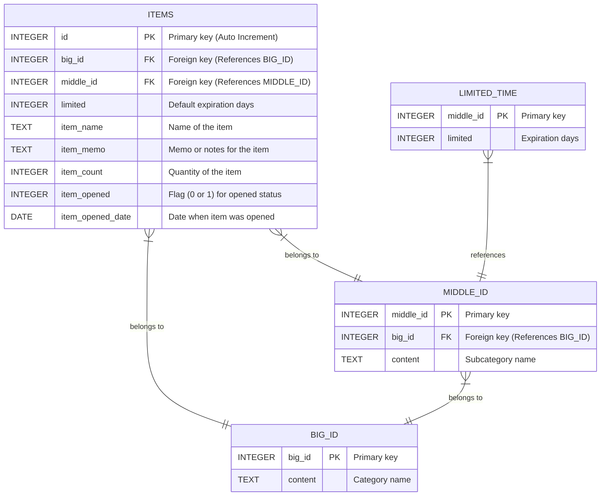

# Cosmetics-inventory-management-system

```mermaid
erDiagram
    ITEMS {
        INTEGER id PK "Primary key (Auto Increment)"
        INTEGER big_id FK "Foreign key (References BIG_ID)"
        INTEGER middle_id FK "Foreign key (References MIDDLE_ID)"
        INTEGER limited "Default expiration days"
        TEXT item_name "Name of the item"
        TEXT item_memo "Memo or notes for the item"
        INTEGER item_count "Quantity of the item"
        INTEGER item_opened "Flag (0 or 1) for opened status"
        DATE item_opened_date "Date when item was opened"
    }

    BIG_ID {
        INTEGER big_id PK "Primary key"
        TEXT content "Category name"
    }

    MIDDLE_ID {
        INTEGER middle_id PK "Primary key"
        INTEGER big_id FK "Foreign key (References BIG_ID)"
        TEXT content "Subcategory name"
    }

    LIMITED_TIME {
        INTEGER middle_id PK "Primary key"
        INTEGER limited "Expiration days"
    }

    ITEMS }|--|| BIG_ID : "belongs to"
    ITEMS }|--|| MIDDLE_ID : "belongs to"
    MIDDLE_ID }|--|| BIG_ID : "belongs to"
    LIMITED_TIME }|--|| MIDDLE_ID : "references"

```
